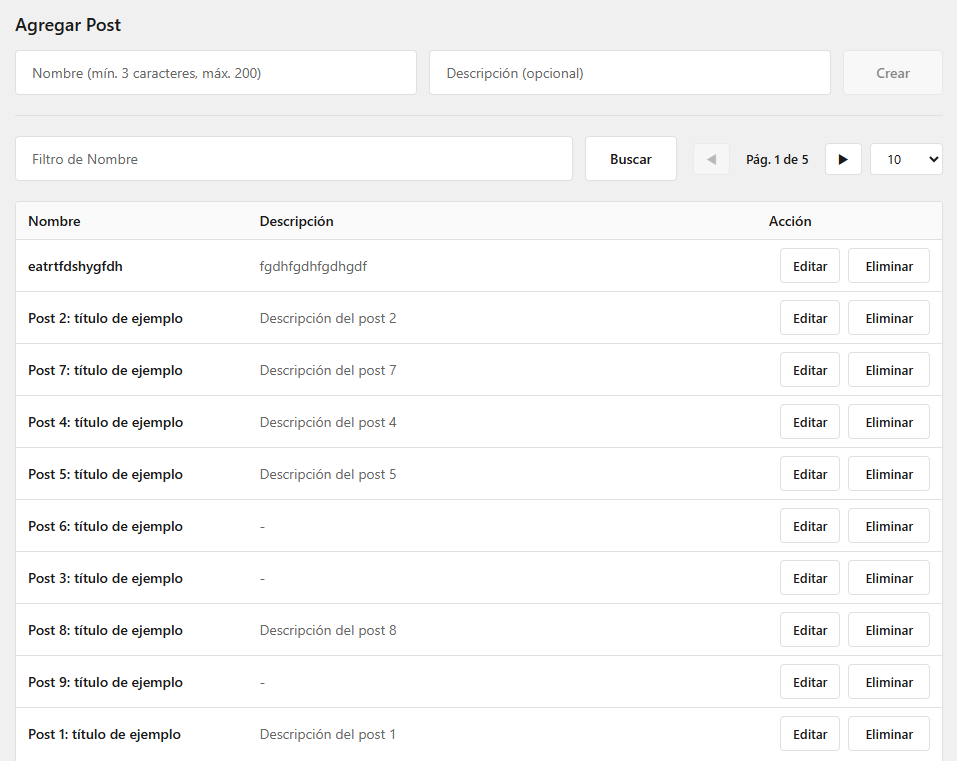

# Test técnico full‑stack – Backend‑first (Node/Express/Prisma) + Frontend (React/Vite/RTK)



[➡ Quick Start](./QUICKSTART.md)

Repositorio de una app web full‑stack construida con enfoque backend‑first: contrato OpenAPI, backend Node.js + Express (TypeScript) con Prisma/PostgreSQL y pruebas; luego frontend React + Vite + Redux Toolkit (TypeScript). Clean Architecture, IDs UUID, paginación por offset, Docker para dev y CI en GitHub Actions.

Importante: En esta fase no se generará código. Esta documentación define alcance, arquitectura, contratos y el plan de trabajo (TODO) siguiendo buenas prácticas, clean code y camelCase.

## Objetivo

Construir una app con:
- Frontend: React + Redux Toolkit (TypeScript) con Vite.
- Backend: Node.js + Express (TypeScript) con ORM Prisma.
- Base de datos: PostgreSQL.
- Dominio: modelo de "posts" tipo red social, con los campos mínimos: name y description.
# Resumen Ejecutivo

Este repositorio acompaña un test técnico para una posición Senior Software Engineer. La implementación seguirá clean architecture, buenas prácticas y camelCase. La documentación completa está en `/docs`. Consulta el índice: `docs/README.md`.

## Alcance funcional
- Dominio: posts tipo red social con campos mínimos `name` y `description`.
- CRUD de posts via API REST.

## Tecnologías (con justificación)
- Frontend: React + TypeScript + Redux Toolkit, bundler Vite.
	- Justificación: Vite ofrece arranque/HMR muy rápidos, configuración mínima y build robusto (Rollup), lo que permite enfocarse en el dominio del test y calidad de código.
- Backend: Node.js + Express (TypeScript) con Prisma ORM.
	- Justificación: Express es minimalista y conocido; Prisma acelera el acceso a datos con tipado fuerte y migraciones.
- Base de datos: PostgreSQL.
	- Justificación: relacional madura, fácil de dockerizar y ampliamente soportada.

Más detalle, ver:
- `docs/adr/0001-frontend-bundler-vite.md` (decisión de Vite)
- `docs/adr/0002-ids-uuid-vs-autoincrement.md` (IDs UUID por escalabilidad)
- `docs/adr/0003-pagination-offset-vs-cursor.md` (paginación por offset)
- `docs/api.md` (contrato de API)
- `docs/db.md` (modelo y migraciones)
- `docs/backend.md` (arquitectura y guía del backend)
- `docs/frontend.md` (estructura del cliente)
 - `docs/client.md` (quickstart del cliente)
 - `docs/frontend-best-practices.md` (buenas prácticas de React)
- `docs/conventions.md` (estilo y prácticas)
- `docs/docker.md` (contenedores y docker-compose)
 - `docs/testing.md` (estrategia de pruebas)
 - `docs/quality.md` (calidad de código)
 - `docs/ci.md` (lineamientos de CI/CD)
 - `docs/openapi.md` (documentación de API OpenAPI/Swagger)
 - `docs/observability.md` (logging y errores)
 - `docs/pino-http.md` (guía de pino-http en el backend)
 - `docs/review.md` (checklist de code review)
 - `docs/assessment.md` (informe de cumplimiento)

Guías rápidas:
- `QUICKSTART.md` (arranque inmediato)
- `TODO.md` (plan granular de trabajo)

## Author

Diego Morales Contreras  
Email: <moralesc.diego@gmail.com>

## Distribución del proyecto (propuesta)
```
root/
	client/           # React + Vite + RTK
	server/           # Express + Prisma + capas
	docs/             # documentación y ADRs
	.editorconfig
	.gitignore
	docker-compose.yml
	README.md
	package.json      # scripts de orquestación (cuando se implemente)
```

## Plan de trabajo (TODO)

- [ ] Scaffold project structure (root, server, client)
	- Create root folder files: package.json con scripts, .gitignore, .editorconfig, docker-compose.yml. Crear carpetas server y client.
- [ ] Implement backend (Node + Express + Prisma)
	- App Express en TypeScript con capas controllers/services/repositories. Prisma schema para Post (id, name, description, timestamps). Validación con Zod, CORS, helmet, error handling, config .env.
- [ ] Implement frontend (React + Redux Toolkit + Vite)
	- React + TS con Vite. Store y slice de posts con thunks para CRUD. Componentes: PostsList, PostForm. API client usando VITE_API_BASE_URL.
- [ ] Install dependencies and initialize Prisma
	- npm install en server y client; script root para correr ambos; prisma generate y migraciones; docker-compose para Postgres.
- [ ] Build/verify y documentar run steps
	- Verificar build de server (tsc) y client (Vite). Actualizar README con comandos PowerShell para dev y migraciones.

## Estado de contenedores (Docker)
El proyecto se dockerizará para desarrollo y/o demo. La guía de contenedores, variables y `docker-compose` está en `docs/docker.md`.
- Configuración local de DB: docker-compose y `.env.example` claros.

---

Esta documentación será la fuente de verdad para la implementación. Cualquier cambio de alcance se reflejará aquí antes de escribir código.
